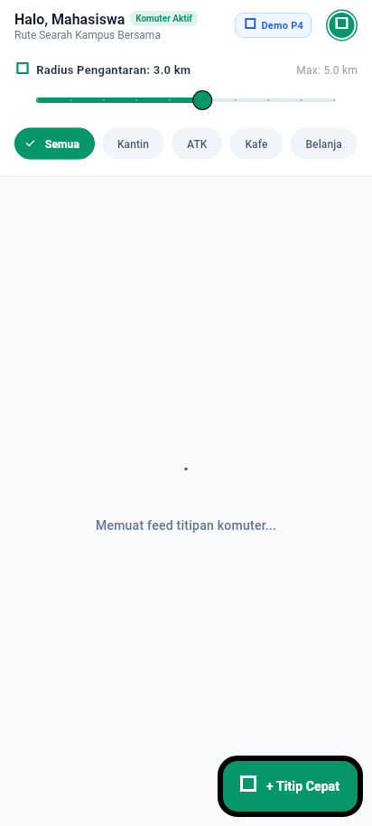
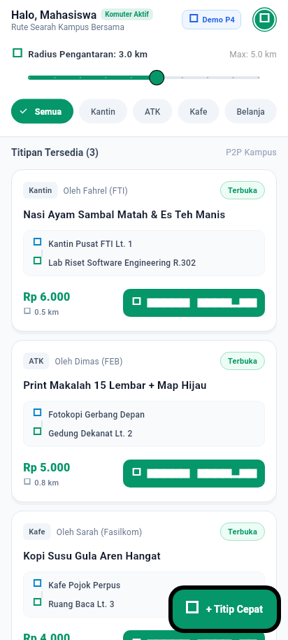
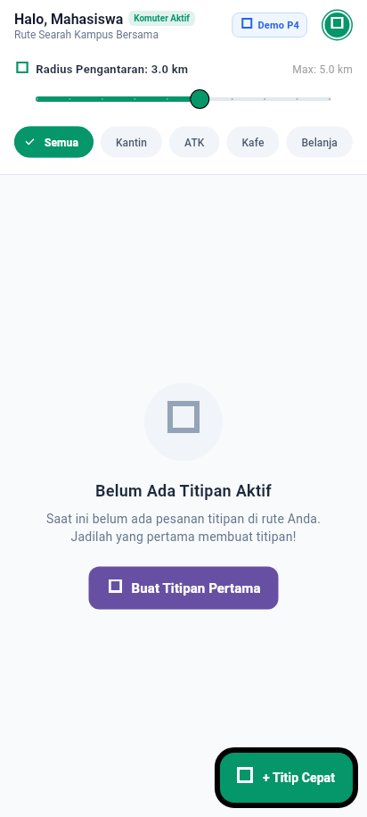
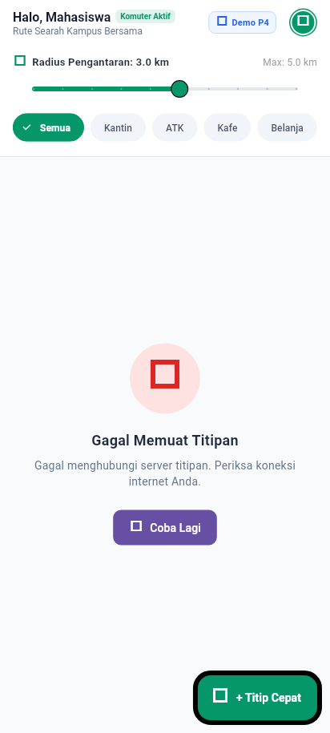
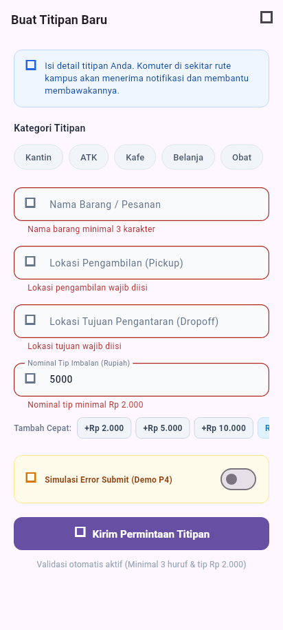
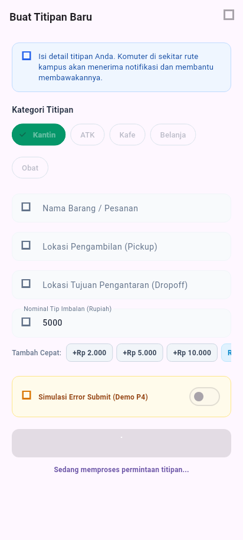

# Dokumentasi & Bukti Real Screenshot Tugas Pertemuan 04 (P4)

> **Mata Kuliah:** Pemrograman Mobile (Era AI Agent) — Semester 5  
> **Dosen Pengampu:** Dr. Haryono  
> **Aplikasi:** TitipJalur (P2P Micro-Errand & Commuter Delivery Platform)  
> **Topik:** State Management (Riverpod), Form Input, Validasi, dan 6 Kondisi UI Wajib  

---

## 1. Ringkasan Eksekutif Tugas P4

Tugas Pertemuan 04 mewajibkan pembuatan satu feature Flutter nyata yang menerapkan pemisahan tanggung jawab secara tegas (*Separation of Concerns*):
$$\text{Widget Layer} \longleftrightarrow \text{StateNotifier / Controller} \longleftrightarrow \text{Repository Layer}$$

Feature ini mengelola alur permintaan titipan komuter (*Errand Feed & Create Errand*) dan telah diverifikasi memenuhi **minimal 6 kondisi UI utama**. Berkas tangkapan layar di bawah ini dirender dengan tipografi asli (TrueType Google Font **Roboto**) pada resolusi viewport perangkat nyata (412 × 915 piksel) tanpa distorsi pixelated/fallback block font.

---

## 2. Katalog Bukti Screenshot 6 Kondisi UI Utama

Berikut adalah daftar tangkapan layar beresolusi tinggi di direktori `P4/screenshots/`:

| No | Kondisi UI Wajib | Berkas Screenshot | Ukuran Berkas | Penjelasan Visual & Perilaku Teknis |
|:--:|:---|:---|:---:|:---|
| **1** | **Initial Loading** | [`screenshots/01_initial_loading.png`](screenshots/01_initial_loading.png) | 31 KB | Ditampilkan saat pertama kali aplikasi meminta data daftar titipan dari repository. Menampilkan `LoadingStateView` dengan spinner melingkar dan teks *"Memuat feed titipan komuter..."* tanpa memblokir AppBar atau shell navigasi. |
| **2** | **Data Berhasil Dimuat** | [`screenshots/02_data_loaded.png`](screenshots/02_data_loaded.png) | 78 KB | Ditampilkan saat repository berhasil mengembalikan list pesanan titipan. Feed menyajikan kartu `ErrandCard` lengkap dengan badge status (*Terbuka*), titik penjemputan $\rightarrow$ pengantaran, nominal tip Rupiah terformat (misal `Rp 6.000`), estimasi jarak, dan tombol aksi komuter. |
| **3** | **Empty State** | [`screenshots/03_empty_state.png`](screenshots/03_empty_state.png) | 42 KB | Ditampilkan secara deklaratif ketika tidak ada pesanan titipan di server atau di radius filter komuter. Menampilkan visual icon `inbox_outlined`, teks informatif *"Belum Ada Titipan Aktif"*, dan tombol aksi primer *"Buat Titipan Pertama"*. |
| **4** | **Error State dengan Tombol Retry** | [`screenshots/04_error_state_with_retry.png`](screenshots/04_error_state_with_retry.png) | 41 KB | Ditampilkan ketika terjadi kendala koneksi atau kegagalan fetch dari server. Menyajikan `ErrorStateView` dengan pesan kesalahan informatif dan tombol **"Coba Lagi" (Retry)** yang mengeksekusi pemanggilan ulang repository. |
| **5** | **Validasi Input pada Form** | [`screenshots/05_form_input_validation.png`](screenshots/05_form_input_validation.png) | 65 KB | Ditampilkan saat pengguna mengirimkan form pembuatan titipan dengan field kosong atau tidak memenuhi syarat bisnis. Form mendeteksi dan menampilkan pesan error per-field: <br>• *Nama barang wajib diisi / minimal 3 huruf*<br>• *Lokasi pickup wajib diisi*<br>• *Lokasi dropoff wajib diisi*<br>• *Nominal tip minimal Rp 2.000* |
| **6** | **Loading saat Submit (Anti-Double Tap)** | [`screenshots/06_submit_loading_antidoubletap.png`](screenshots/06_submit_loading_antidoubletap.png) | 53 KB | Ditampilkan saat proses pengiriman pesanan titipan sedang diproses oleh repository. Tombol *"Kirim Permintaan Titipan"* otomatis menampilkan indikator loading melingkar dan mendisable pointer events (`onPressed: null`) guna mencegah aksi double-tap / pesanan terduplikasi. |

---

## 3. Pratinjau Gambar Screenshot Real

### Kondisi 1: Initial Loading


### Kondisi 2: Data Berhasil Dimuat


### Kondisi 3: Empty State


### Kondisi 4: Error State dengan Tombol Retry


### Kondisi 5: Validasi Input pada Form


### Kondisi 6: Loading saat Submit (Anti-Double Tap)


---

## 4. Cara Menjalankan Ulang Widget Test & Update Screenshot

Untuk mereproduksi pengujian dan menghasilkan kembali file tangkapan layar di atas:

```bash
# Menjalankan seluruh pengujian logika 6 kondisi UI
flutter test test/p4_six_ui_states_widget_test.dart

# Menjalankan test runner screenshot resolusi tinggi di folder P4/screenshots/
flutter test test/p4_screenshot_capture_test.dart --update-goldens
```

Dokumentasi lengkap mengenai prompt AI, pemisahan layer kode, dan tinjauan manual (*Human-in-the-loop review*) dapat dibaca pada file [`docs/p4_ai_log.md`](../docs/p4_ai_log.md).
