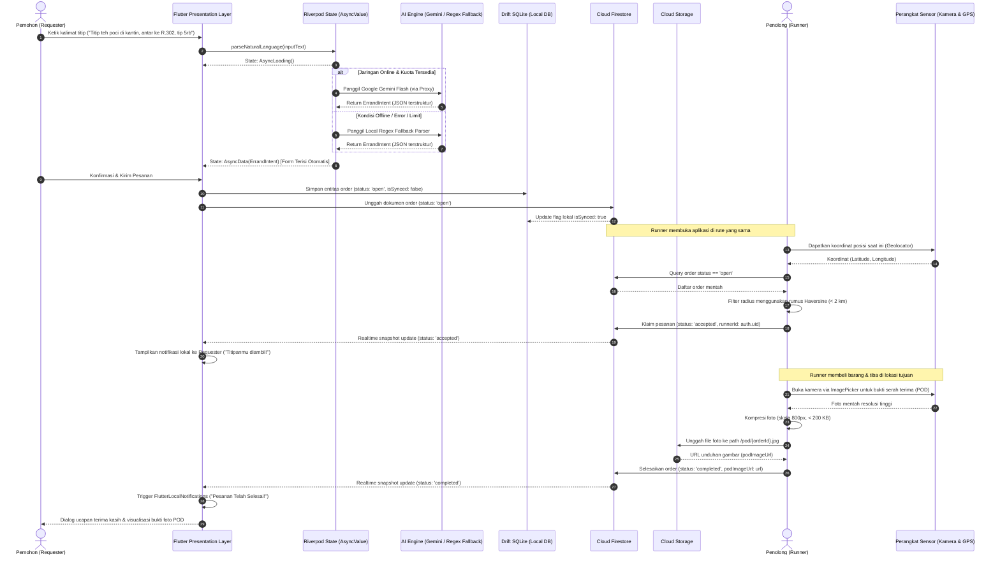

# Architecture Decision Record (ADR) — TitipJalur

> **Judul:** Dokumen Arsitektur Sistem & Spesifikasi Teknis Platform P2P Micro-Errand & Commuter Delivery  
> **Status:** Final & Definitif (Approved Baseline)  
> **Tanggal Rilis:** 18 September 2026  
> **Konteks Akademik:** Mata Kuliah Pemrograman Mobile (Semester 5) — Dosen Pengampu: Dr. Haryono  
> **Target Evaluasi:** UTS (Vertical Slice Prototype) & UAS (Production Release APK Fisik Android)  

---

## 1. Ringkasan Eksekutif

### 1.1 Konsep Produk & Model Bisnis P2P
**TitipJalur** adalah platform *Peer-to-Peer (P2P) Micro-Errand & Commuter Delivery* yang menghubungkan kebutuhan penitipan barang atau makanan berskala *hyperlocal* (< 1–2 km) dengan rute perjalanan harian mahasiswa dan kaum komuter. 

TitipJalur beroperasi sebagai **perantara murni tanpa inventaris fisik (*Zero-Inventory, Asset-Light Model*)**. Platform tidak memiliki armada pengemudi terdedikasi, tidak menampung stok barang pergudangan, dan tidak menetapkan tarif monopsoni. Platform hanya memfasilitasi interaksi dua sisi (*two-sided marketplace*):

| Peran Pengguna | Deskripsi Operasional | Proposisi Nilai (*Value Proposition*) |
| :--- | :--- | :--- |
| **Requester (Pemohon)** | Pengguna yang memerlukan bantuan pembelian atau pengambilan barang/makanan dari lokasi terdekat. | Bebas dari biaya minimum pengiriman kurir konvensional yang mahal; pemesanan instan lewat input teks bahasa santai/alami (*Natural Language*). |
| **Runner (Penolong)** | Mahasiswa atau komuter yang sedang melintasi rute yang searah dengan titik penjemputan dan pengantaran. | Memperoleh insentif/uang saku tambahan (*micro-tip*) secara fleksibel tanpa ikatan jam kerja atau registrasi mitra korporat yang rumit. |

### 1.2 Konteks Akademik 12 Pertemuan (Era AI Agent)
Pengembangan aplikasi ini dirancang dalam kerangka kurikulum 12 pertemuan di bawah arahan **Dr. Haryono**. Dalam paradigma **Era AI Agent**, AI tidak hanya diposisikan sebagai fitur aplikasi di level hilir, melainkan sebagai metodologi rekayasa perangkat lunak di level hulu:
1. **AI sebagai Copilot Rekayasa:** Penggunaan AI Agent untuk *architecture planning*, scaffolding kode bersih (*Clean Architecture*), refactoring, dan automated verification (tercatat transparan pada `docs/ai-agent-log.md`).
2. **AI sebagai Fitur Cerdas (In-App AI):** Pemanfaatan *Natural Language Errand Parser* dan *Smart Tip Recommender* berbasis Google Gemini Flash untuk mengabstraksi kerumitan pengisian formulir manual menjadi satu kalimat sederhana.
3. **Target Evaluasi:**
   - **UTS (Pertemuan 6):** Demonstrasi *Vertical Slice* end-to-end (input bahasa alami $\rightarrow$ AI Parser $\rightarrow$ penyimpanan lokal $\rightarrow$ sinkronisasi cloud $\rightarrow$ feed reaktif $\rightarrow$ penanganan status *Loading/Error/Empty*).
   - **UAS (Pertemuan 12):** Pengujian APK rilis fisik (*standalone production build*) pada perangkat nyata Android dengan integrasi sensor perangkat keras (GPS Haversine, Kamera POD, dan Notifikasi Lokal) yang tahan uji dalam kondisi offline/gangguan sinyal.

---

## 2. Rekomendasi Tech Stack Definitif & Justifikasi

Setiap komponen teknologi dipilih berdasarkan bukti empiris kelayakan teknis (*technical feasibility*), performa deterministik pada lingkungan Linux, batasan biaya operasional Rp 0 (*zero budget*), dan kesesuaian rubrik penilaian akademik.

### 2.1 Matriks Komparasi & Pemilihan Teknologi

| Layer Arsitektur | Pilihan Definitif | Versi Stabil | Alternatif Terevaluasi | Alasan Pemilihan & Keunggulan Komparatif |
| :--- | :--- | :--- | :--- | :--- |
| **Mobile Framework** | **Flutter (Dart)** | `3.x` (Dart SDK `^3.7.0`) | React Native (Expo), Kotlin Multiplatform (KMP) | • Scaffold proyek sudah siap dan teruji di direktori `lib/`.<br>• **Build APK lokal offline deterministik** di lingkungan Linux via `flutter build apk --release` tanpa antrean cloud pihak ketiga (berbeda dengan React Native Expo yang bergantung pada antrean kuota EAS Build).<br>• Performa rendering native via Skia/Impeller 60–120 FPS tanpa jembatan (*JS bridge overhead*).<br>• Ekosistem plugin sensor perangkat keras (GPS, kamera, background notification) sangat matang dalam satu basis kode Dart. |
| **State Management** | **Riverpod** | `flutter_riverpod: ^3.4.3` | BLoC, Provider, GetX | • Tipe data `AsyncValue<T>` menyediakan penanganan deklaratif bawaan untuk 3 kondisi: `.loading()`, `.error(err, stack)`, dan `.data(val)` (langsung memenuhi rubrik wajib UTS Dr. Haryono: *Loading / Error / Empty State*).<br>• Menghilangkan boilerplate masif event-state class pada BLoC yang tidak efisien untuk siklus rilis 12 minggu.<br>• Sepenuhnya *compile-safe*, bebas dari `BuildContext` dependencies, dan mendukung *dependency injection* murni yang mudah diuji (*mockable unit testing*). |
| **Local Persistence (Offline-First)** | **Drift (SQLite)** + SharedPreferences | `drift: ^2.35.0`<br>`shared_preferences: ^2.3.5` | Hive, Isar, SQFlite raw | • **Struktur Relasional Esensial:** Entitas pesanan memerlukan pemfilteran multi-kriteria (`status == open`, pengurutan waktu `createdAt`, dan antrean sync `isSynced == false`). Hive/Key-Value NoSQL rapuh untuk query relasional dinamis.<br>• Menyediakan *type-safe SQL abstraction* dan *reactive query streams* (`watch()`) yang memperbarui UI secara instan saat data lokal berubah.<br>• `shared_preferences` dialokasikan khusus untuk *lightweight preference flags* (seperti status onboarding atau preferensi tema). |
| **Backend & Cloud Sync** | **Firebase Spark Plan** | Cloud Firestore, Auth, Storage | Supabase (Free Tier) | • **Zero-Risk Auto-Pause:** Supabase Free Tier menerapkan kebijakan suspensi/pause otomatis apabila basis data idle selama 7 hari (risiko fatal kegagalan demo mendadak saat evaluasi dosen). Firebase Spark **tidak pernah di-pause otomatis**.<br>• **Native Offline Cache:** Firestore Android SDK secara default menyertakan persistensi cache offline lokal berbasis SQLite LRU, menjamin pembacaan data tanpa galat saat koneksi putus.<br>• Kuota gratis Spark (50.000 reads/hari, 20.000 writes/hari) jauh melampaui kebutuhan simulasi akademik. |
| **AI Integration Gateway** | **Google Gemini Flash** (Dual-Mode) | `gemini-1.5-flash` / `gemini-2.0-flash` | Direct OpenAI API, DeepSeek API | • Kecepatan inferensi tinggi (< 1.5 detik) dan alokasi token hemat biaya pada paket gratis.<br>• Kredensial API Key diamankan di sisi server (Firebase AI Logic / Secure Reverse Proxy Worker) sehingga **tidak pernah terekspos di dalam dekompilasi file APK**.<br>• Didukung arsitektur **Dual-Mode AI Graceful Degradation** (LLM online dengan fallback regex terstruktur di perangkat). |
| **Location & Geofencing** | **Geolocator** | `geolocator: ^14.0.3` | Location, Google Maps SDK | • Pengambilan koordinat GPS lintang/bujur presisi tinggi.<br>• Penghitungan jarak radius komuter secara lokal menggunakan algoritma matematis **Haversine Formula** tanpa memakan kuota berbayar Google Maps Distance Matrix API. |
| **Proof of Delivery (POD)** | **Image Picker** | `image_picker: ^1.2.3` | CameraX raw | • Akses kamera native perangkat untuk dokumentasi serah terima barang.<br>• Pipeline kompresi gambar lokal (resolusi target lebar maks 800px, kualitas kompresi menghasilkan file < 200 KB) sebelum diunggah ke Firebase Storage. |
| **System Notifications** | **Flutter Local Notifications** | `flutter_local_notifications: ^22.3.1` | Awesome Notifications | • Notifikasi sistem lokal instan saat transisi status pesanan (`Open` $\rightarrow$ `Accepted` $\rightarrow$ `Completed`) tanpa ketergantungan mutlak pada push server eksternal saat perangkat dalam jaringan lokal. |
| **Permission Management** | **Permission Handler** | `permission_handler: ^13.0.2` | Native channel custom | • Penanganan izin sistem secara modular untuk Android 13+ (API 33/34/35) meliputi izin runtime Kamera, Lokasi (*Fine/Coarse Location*), dan Notifikasi (*POST_NOTIFICATIONS*). |

---

## 3. Integrasi AI Agent: Dual-Mode Architecture & Graceful Degradation

Fitur utama kemudahan TitipJalur adalah kemampuan *Natural Language Errand Parser*. Pengguna cukup mengetik pesan santai (contoh: *"Tolong belikan nasi padang rendang di simpang tiga, antar ke Lab RPL lt 2, kasih tip 7 ribu"*).

```
+-----------------------------------------------------------------------------------+
|                            Input Teks Bahasa Natural                              |
+-----------------------------------------------------------------------------------+
                                         |
                                         v
                         +-------------------------------+
                         | Deteksi Status Konektivitas   |
                         +-------------------------------+
                                  /             \
                   (Online & Kuota OK)       (Offline / Timeout / Limit)
                                /                 \
                               v                   v
            +---------------------------+   +------------------------------+
            |  Primary Engine (Cloud)   |   | Fallback Engine (On-Device)  |
            |  Google Gemini Flash via  |   | Rule-Based Heuristic & Regex |
            |  Secure AI Logic Proxy    |   | Offline Parser (`ai/data`)   |
            +---------------------------+   +------------------------------+
                                \                 /
                                 v               v
            +-------------------------------------------------------+
            | Output Entitas Terstruktur (Normalized JSON):         |
            | {                                                     |
            |   "item": "Nasi Padang Rendang",                      |
            |   "pickup": "Simpang Tiga",                           |
            |   "dropoff": "Lab RPL Lt 2",                          |
            |   "tip": 7000                                         |
            | }                                                     |
            +-------------------------------------------------------+
```

### 3.1 Kontrak Skema Parser
Kedua engine AI wajib mengembalikan struktur objek `ErrandIntent` yang identik:
```json
{
  "item": "String (Nama komoditas/barang yang diminta)",
  "pickup": "String (Lokasi pengambilan/toko/kantin)",
  "dropoff": "String (Tujuan pengantaran barang)",
  "tip": 0
}
```

### 3.2 Strategi Keamanan API Key & Reverse Proxy
Menyimpan API Key Gemini secara langsung di dalam kode Dart (`flutter build`) merupakan pelanggaran keamanan serius karena dapat diekstraksi melalui *reverse engineering* APK menggunakan `jadx` atau strings inspector.
- **Pola Implementasi:** Permintaan parsing dikirimkan ke endpoint perantara yang terautentikasi (Firebase AI Logic / Cloudflare Worker Proxy).
- **Enforcement:** Proxy memvalidasi token sesi pengguna (`Firebase Auth ID Token`) dan memeriksa integritas aplikasi sebelum meneruskan permintaan ke Gemini API dengan kunci rahasia yang tersimpan di environment server.

---

## 4. Struktur Direktori Proyek (Clean Architecture / Feature-First)

Struktur kode diatur dengan prinsip **Feature-First + Clean Architecture**, memastikan batas tanggung jawab (*separation of concerns*) yang jelas, kemudahan navigasi bagi AI Agent, serta isolasi dependensi yang ketat.

```text
lib/
├── app.dart                                # Konfigurasi MaterialApp, Theme, Router
├── main.dart                               # Entry point, inisialisasi Firebase & Drift
│
├── core/                                   # Modul lintas fitur (fondasi sistem)
│   ├── config/
│   │   ├── env.dart                        # Environment config & constants
│   │   └── firebase_options.dart           # Auto-generated FlutterFire configuration
│   ├── constants/
│   │   └── app_colors.dart                 # Design tokens (warna, font, radius)
│   ├── network/
│   │   └── network_info.dart               # Connectivity checker (online/offline state)
│   ├── services/
│   │   ├── location_service.dart           # Wrapper Geolocator & Haversine formula
│   │   ├── notification_service.dart       # Wrapper FlutterLocalNotifications
│   │   └── storage_service.dart            # Wrapper Firebase Cloud Storage
│   └── widgets/
│       ├── async_value_widget.dart         # Universal Riverpod AsyncValue handler
│       └── state_view.dart                 # Komponen Loading, Error, Empty State
│
├── features/                               # Fitur modular (Feature-First)
│   │
│   ├── auth/                               # Manajemen Sesi Pengguna
│   │   ├── data/
│   │   │   └── auth_repository_impl.dart   # Implementasi FirebaseAuth
│   │   ├── domain/
│   │   │   ├── entities/user_entity.dart   # Model pengguna internal
│   │   │   └── repositories/auth_repo.dart # Interface kontrak autentikasi
│   │   └── presentation/
│   │       ├── controllers/auth_controller.dart
│   │       └── screens/login_screen.dart
│   │
│   ├── errand/                             # Domain Inti: Titipan & Pengiriman
│   │   ├── data/
│   │   │   ├── datasources/
│   │   │   │   ├── errand_local_source.dart   # Drift SQLite Database & DAO
│   │   │   │   └── errand_remote_source.dart  # Cloud Firestore Collections
│   │   │   ├── models/
│   │   │   │   └── errand_order_model.dart    # DTO serializer/deserializer
│   │   │   └── repositories/
│   │   │       └── errand_repository_impl.dart# Sinkronisasi Offline-First & Remote
│   │   ├── domain/
│   │   │   ├── entities/
│   │   │   │   ├── errand_order.dart          # Entity utama
│   │   │   │   └── order_status.dart          # Enum Open, Accepted, Completed
│   │   │   └── repositories/errand_repo.dart  # Interface kontrak domain
│   │   └── presentation/
│   │       ├── controllers/
│   │       │   ├── errand_feed_controller.dart# Provider feed berbasis radius
│   │       │   └── create_errand_controller.dart
│   │       ├── screens/
│   │       │   ├── errand_feed_screen.dart    # List order radius terdekat
│   │       │   ├── create_errand_screen.dart  # Form input / NLP smart prompt
│   │       │   └── errand_detail_screen.dart  # Detail aksi & upload kamera POD
│   │       └── widgets/
│   │           ├── errand_card.dart
│   │           └── camera_pod_dialog.dart
│   │
│   ├── ai/                                 # Sub-sistem NLP & Rekomendasi
│   │   ├── data/
│   │   │   ├── gemini_ai_parser_source.dart   # Remote parser via Proxy
│   │   │   └── regex_fallback_parser.dart     # On-device rule-based parser
│   │   ├── domain/
│   │   │   ├── entities/errand_intent.dart    # Entitas hasil parsing
│   │   │   └── repositories/ai_parser_repo.dart
│   │   └── presentation/
│   │       └── controllers/ai_parser_controller.dart
│   │
│   └── notification/                       # Handler notifikasi lokal & alarm
│       └── presentation/
│           └── controllers/notification_controller.dart
│
└── shared/                                 # Utility pembantu
    ├── extensions/context_extensions.dart
    ├── formatters/currency_formatter.dart  # Format Rupiah (Rp X.XXX)
    └── utils/haversine_calculator.dart     # Perhitungan jarak koordinat lokal
```

---

## 5. Desain Data & Lifecycle Status Order

### 5.1 Spesifikasi Entitas Data `ErrandOrder`
Skema data dirancang seragam antara tabel Drift SQLite di perangkat klien dan koleksi dokumen Firestore di cloud backend.

| Atribut Data | Tipe Data | Nullable | Sumber / Penentu Nilai | Keterangan Fungsional |
| :--- | :--- | :---: | :--- | :--- |
| `id` | `String` | Tidak | UUID v4 / Firestore Doc ID | Kunci primer entitas di SQLite dan Firestore. |
| `item` | `String` | Tidak | AI Parser / Input Form | Nama barang/makanan yang dititipkan. |
| `pickup` | `String` | Tidak | AI Parser / Input Form | Alamat/lokasi titik pengambilan barang. |
| `dropoff` | `String` | Tidak | AI Parser / Input Form | Alamat/lokasi titik pengantaran barang. |
| `tip` | `int` | Tidak | AI Smart Tip / Manual Form | Nominal kompensasi jasa Runner dalam Rupiah. |
| `status` | `String` | Tidak | State Machine Controller | Nilai enum: `'open'`, `'accepted'`, `'completed'`. |
| `requesterId` | `String` | Tidak | Firebase Auth (`currentUser.uid`) | ID unik pengguna pembuat pesanan. |
| `runnerId` | `String` | Ya | Runner yang mengambil pesanan | Terisi saat transisi status menuju `accepted`. |
| `podImageUrl` | `String` | Ya | Firebase Cloud Storage | URL bukti foto serah terima (*Proof of Delivery*). |
| `isSynced` | `bool` | Tidak | Drift Local Flag | `true` jika sudah terunggah ke Firestore; `false` jika masih di antrean offline. |
| `createdAt` | `DateTime` | Tidak | Sistem Klien / Server Timestamp | Waktu pembuatan pesanan untuk pengurutan feed. |
| `updatedAt` | `DateTime` | Tidak | Server Timestamp | Penanda resolusi konflik *Last-Write-Wins*. |

### 5.2 Siklus Transisi Status Pesanan (*State Machine*)

```text
[ DRAFT LOKAL ]
       |
       v  (Submit & Sync)
  +----------+         Runner Accept          +--------------+         Upload POD          +---------------+
  |   OPEN   |  --------------------------->  |   ACCEPTED   |  -------------------------> |   COMPLETED   |
  +----------+                                +--------------+                             +---------------+
       |                                             |                                             |
  Tampil pada feed                             Terkunci untuk                                Dokumentasi POD
  semua Runner                                 Runner terpilih;                              tersimpan; notif
  dalam radius.                                Requester ternotifikasi.                      selesai dikirim.
```

- **Aturan Transisi Kritis:**
  1. Status **`OPEN`**: Pesanan dapat dilihat oleh seluruh pengguna dalam radius tertentu kecuali oleh `requesterId` (pembuat order tidak diperkenankan mengambil titipannya sendiri).
  2. Status **`ACCEPTED`**: Dokumen pesanan dikunci. `runnerId` wajib bernilai identik dengan `auth.uid` pengguna yang mengeksekusi klaim. Hanya Runner bersangkutan yang berhak mengubah status selanjutnya.
  3. Status **`COMPLETED`**: Hanya dapat dipicu apabila field `podImageUrl` telah berhasil divalidasi dengan URI foto bukti penyerahan. Status bersifat final (*terminal state*) dan tidak dapat diubah kembali.

### 5.3 Strategi Sinkronisasi Dua Arah (Drift SQLite $\leftrightarrow$ Cloud Firestore)
Aplikasi menerapkan strategi **Optimistic Offline-First with Background Outbox Sync**:
1. **Operasi Tulis Lokal (Local Write):** Ketika Requester membuat order atau Runner menyelesaikan order tanpa sinyal internet, entitas langsung ditulis ke basis data lokal Drift dengan flag `isSynced = false`. UI pengguna langsung bereaksi tanpa *blocking screen*.
2. **Antrean Unggah (Outbox Replay):** Layanan `NetworkInfo` mendengarkan perubahan status konektivitas perangkat via broadcast stream. Begitu koneksi internet tersambung, sistem melakukan iterasi batch pada seluruh baris dengan `isSynced == false` untuk di-*replay* ke Firestore melalui transaksi atomik.
3. **Resolusi Konflik:** Menggunakan pendekatan deterministik berbasis status: status `completed` memiliki preseden lebih tinggi daripada `accepted`, dan `accepted` lebih tinggi daripada `open`. Untuk konflik waktu pada status setara, prinsip *Last-Write-Wins (LWW)* berbasis atribut `updatedAt` diterapkan.

---

## 6. Diagram Alur Data & Vertical Slice (UTS Evaluasi)

Diagram berikut merepresentasikan aliran kerja vertikal (*Vertical Slice*) yang diuji pada demonstrasi evaluasi UTS, mencakup input bahasa santai, parsing AI, persistensi lokal, penyiaran cloud, hingga penutupan pesanan dengan sensor kamera.



---

## 7. Roadmap Implementasi 12 Pertemuan

Rencana kerja dirancang terstruktur dalam 4 tahapan untuk memenuhi pencapaian mingguan dan target evaluasi mata kuliah:

| Tahap | Minggu | Target Milestone | Fokus Deliverable Teknis | Indikator Keberhasilan (*Acceptance Criteria*) |
| :---: | :---: | :--- | :--- | :--- |
| **Tahap 1: Inisiasi & Desain** | **M1** | Project Setup & Toolchain Verification | Verifikasi SDK Flutter 3.x, Android SDK, JDK 17+, setup repositori Git, konfigurasi `.gitignore` ketat, dan inisiasi dokumen `docs/ai-agent-log.md`. | Perintah `flutter doctor -v` bersih tanpa error; repositori GitHub bersih dari file sensitif. |
| | **M2** | Domain Architecture & Firebase Setup | Setup proyek Firebase Spark, konfigurasi `firebase_core`, finalisasi kontrak skema entitas `ErrandOrder` dan enum `OrderStatus`. | File `firebase_options.dart` terhubung; skema domain tervalidasi pada unit test awal. |
| | **M3** | Authentication & Shell Navigation | Implementasi modul `features/auth` (Firebase Auth email/anonim), routing navigasi dasar, dan tema Material 3. | Pengguna dapat masuk/keluar; sesi tersimpan aman; shell navigasi bottom bar berjalan mulus. |
| **Tahap 2: Konstruksi Inti (UTS)** | **M4** | Riverpod State & StateView Components | Implementasi `flutter_riverpod: ^3.4.3`, pembuatan komponen universal `StateView` untuk visualisasi status *Loading*, *Error*, dan *Empty*. | Rubrik UTS Loading/Error/Empty state terpenuhi secara deklaratif via `AsyncValue`. |
| | **M5** | Local Storage (Drift SQLite) & AI Fallback | Setup `drift: ^2.35.0`, pembuatan tabel lokal, DAO, reactive streams, serta parser regex lokal di `lib/features/ai/data/`. | Aplikasi dapat membuat dan menampilkan riwayat pesanan secara penuh dalam mode pesawat (*airplane mode*). |
| | **M6** | **UTS Evaluation: Vertical Slice Prototype** | Integrasi Google Gemini Flash (Dual-Mode), sinkronisasi Drift $\leftrightarrow$ Firestore, demonstrasi end-to-end pembuatan hingga penyelesaian order. | **Vertical Slice UTS berjalan sempurna**: Input teks $\rightarrow$ parsing $\rightarrow$ feed $\rightarrow$ klaim $\rightarrow$ selesai. |
| **Tahap 3: Sensor & Pengerasan** | **M7** | Geolocation & Radius Filter | Integrasi `geolocator: ^14.0.3`, kalkulasi jarak Haversine lokal di `shared/utils/`, dan UI slider radius komuter. | Runner hanya melihat pesanan terbuka dalam batas radius yang dipilih (contoh: < 1.5 km). |
| | **M8** | Proof of Delivery (Kamera) & Storage | Integrasi `image_picker: ^1.2.3`, pipeline kompresi gambar lokal (< 200 KB), dan upload ke Firebase Cloud Storage. | Runner wajib memotret barang untuk menyelesaikan pesanan; foto tampil di detail pesanan Requester. |
| | **M9** | Local Notifications & Responsive Layout | Integrasi `flutter_local_notifications: ^22.3.1`, audit UI adaptif keyboard (`viewInsets`), dan pengujian pada berbagai rasio layar. | Notifikasi muncul saat status order berubah; input teks pada bottom sheet tidak tertutup keyboard virtual. |
| **Tahap 4: Finalisasi & Rilis (UAS)** | **M10** | Release APK Compilation & App Check | Konfigurasi release build Android (`split-per-abi` untuk optimasi ukuran file), pengaktifan App Check (Play Integrity). | Terbentuk file rilis APK fisik mandiri (`build/app/outputs/flutter-apk/app-release.apk`) tanpa crash saat diinstal. |
| | **M11** | Physical Device Field Testing & Edge Cases | Uji coba langsung di lingkungan kampus pada perangkat Android fisik (kondisi sinyal lemah, transisi online-offline). | Penanganan *graceful degradation* terverifikasi; tidak ada force close (*crash rate 0%*). |
| | **M12** | **UAS Showcase: Final Presentation** | Demonstrasi langsung APK release di depan penguji, penyerahan repositori GitHub, APK fisik, dan log aktivitas AI Agent. | Seluruh kriteria fungsional dan non-fungsional terpenuhi; dokumentasi arsitektur final disetujui. |

---

## 8. Ketentuan Non-Fungsional, Keamanan & Mitigasi Risiko

### 8.1 Manajemen Keamanan Kredensial & Secrets
- **Aturan `.gitignore` Mutlak:** File `google-services.json` (baik di root maupun di `android/app/`), file keystore rilis (`*.jks`, `*.keystore`), dan file environment lokal (`.env`) dilarang keras di-commit ke repositori Git.
- **Kredensial API Eksternal:** API Key Gemini tidak dimasukkan ke dalam kode aplikasi Dart. Seluruh interaksi diarahkan melalui reverse proxy atau Firebase AI Logic yang diatur melalui kredensial akun layanan (*service account*).

### 8.2 Aturan Keamanan Basis Data (Firestore Security Rules)
Untuk melindungi data dari manipulasi langsung pada klien, aturan keamanan Firestore dirancang berbasis peran (*Role-Based Security*):

```javascript
rules_version = '2';
service cloud.firestore {
  match /databases/{database}/documents {
    
    // Fungsi pembantu autentikasi
    function isAuthenticated() {
      return request.auth != null;
    }
    
    function isOwner(userId) {
      return isAuthenticated() && request.auth.uid == userId;
    }

    match /orders/{orderId} {
      // Siapa pun yang terautentikasi dapat membaca feed pesanan
      allow read: if isAuthenticated();

      // Pembuatan order baru: requesterId wajib cocok dengan ID pengguna login
      allow create: if isAuthenticated() 
        && request.resource.data.requesterId == request.auth.uid
        && request.resource.data.status == 'open'
        && request.resource.data.runnerId == null;

      // Pembaruan status (Claim / Complete)
      allow update: if isAuthenticated() && (
        // Kasus 1: Runner mengklaim order (Open -> Accepted)
        (resource.data.status == 'open' 
          && request.resource.data.status == 'accepted'
          && request.resource.data.runnerId == request.auth.uid
          && resource.data.requesterId != request.auth.uid) // Mencegah self-errand
        ||
        // Kasus 2: Runner menyelesaikan order (Accepted -> Completed)
        (resource.data.status == 'accepted' 
          && request.resource.data.status == 'completed'
          && resource.data.runnerId == request.auth.uid
          && request.resource.data.podImageUrl != null)
      );

      // Penghapusan dokumen dilarang demi audit trail
      allow delete: if false;
    }
  }
}
```

### 8.3 Mitigasi Batasan Kuota Firebase Spark Plan
1. **Firestore Reads Throttling:** Query feed pesanan dibatasi secara ketat menggunakan klausa `.limit(20)` dan pemfilteran waktu (`createdAt >= hari_ini`). Pengambilan data lanjutan menggunakan mekanisme *pagination* (*infinite scroll*).
2. **Efisiensi Cloud Storage:** Seluruh foto POD dikompresi di sisi perangkat klien sebelum proses transfer data. Dengan resolusi 800px dan ukuran < 200 KB, kuota 5 GB penyimpanan gratis Firebase Spark mampu menampung lebih dari 25.000 foto dokumentasi tugas.

### 8.4 Matriks Analisis Risiko & Strategi Kontinjensi

| Potensi Risiko | Tingkat Keparahan | Probabilitas | Strategi Kontinjensi & Mitigasi Teknis |
| :--- | :---: | :---: | :--- |
| **Koneksi internet mati total saat demo di ruang kuliah** | **Kritis** | Sedang | Arsitektur *offline-first*: data lokal tetap terbaca dari Drift SQLite, UI menampilkan indikator *"Mode Offline"*, dan parser otomatis mendegradasi ke regex fallback tanpa crash. |
| **Kuota gratis Gemini API habis / rate-limited saat pengujian** | **Tinggi** | Rendah | Sistem secara otomatis mengalihkan *traffic* parsing ke modul `regex_fallback_parser.dart`. Pengguna tetap dapat mengonfirmasi atau menyunting hasil parsing di formulir. |
| **Izin sensor (Kamera / Lokasi) ditolak oleh pengguna** | **Sedang** | Sedang | Komponen `permission_handler` menangani status penolakan dengan menampilkan dialog edukatif ramah pengguna yang mengarahkan pembukaan menu pengaturan sistem Android. |
| **Ukuran file APK rilis terlalu besar untuk didistribusikan** | **Rendah** | Tinggi | Penggunaan perintah build `flutter build apk --release --split-per-abi`. Ukuran file APK per arsitektur (arm64-v8a) teroptimasi menjadi sekitar 15–20 MB. |

---

## 9. Kesimpulan & Status Baseline

Dokumen arsitektur ini menetapkan fondasi teknis yang solid, terukur, dan realistis untuk proyek **TitipJalur**. Melalui kombinasi **Flutter 3.x**, **Riverpod 3**, **Drift SQLite**, **Firebase Spark**, dan **Dual-Mode AI Gemini Flash**, sistem siap dibangun secara inkremental menuju pemenuhan *Vertical Slice* pada UTS dan *Production Release APK* pada UAS.

Seluruh tim pengembang dan AI Agent yang bertugas wajib mematuhi konvensi, struktur folder, dan kontrak data yang telah ditetapkan dalam dokumen ini. Setiap deviasi arsitektur wajib dicatat melalui amandemen formal pada *Architecture Decision Record* ini.
