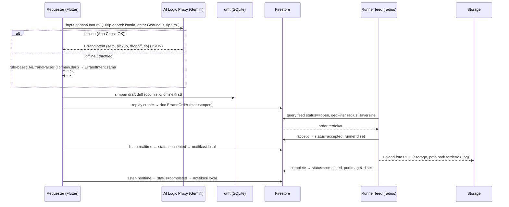

# Architecture Decision Record — TitipJalur

> **Judul:** Arsitektur Aplikasi P2P Micro-Errand & Commuter Delivery Platform
> **Status:** Keputusan Final (bukan proposal)
> **Tanggal:** 2026-09-18
> **Konteks Mata Kuliah:** Pemrograman Mobile (Era AI Agent) — evaluasi UTS (Vertical Slice) & UAS (Release APK fisik Android).

---

## 1. Ringkasan Eksekutif

**TitipJalur** adalah *Peer-to-Peer Micro-Errand & Commuter Delivery Platform*: marketplace dua sisi yang menghubungkan kebutuhan titip barang/makanan **hyperlocal** (< 1–2 km) dengan rute harian mahasiswa dan komuter. TitipJalur adalah **perantara murni tanpa inventory** — tidak memiliki armada, tidak menahan barang, tidak menetapkan harga layanan; ia hanya mempertemukan dua peran:

| Peran | Definisi | Nilai yang diperoleh |
| :--- | :--- | :--- |
| **Requester** (Pemohon) | Mahasiswa/pegawai yang butuh barang dibelikan & diantar cepat dari titik terdekat. | Mengurangi biaya kirim minimum kurir konvensional; pemesanan cepat lewat teks bahasa natural. |
| **Runner** (Penolong) | Mahasiswa/komuter yang sedang menempuh rute searah. | Uang saku tambahan tanpa jam kerja tetap & tanpa registrasi mitra formal. |

Era AI Agent dimanfaatkan pada tiga lapis: (1) **Natural Language Errand Parser** untuk mengubah kalimat santai menjadi order terstruktur, (2) **AI Agent sebagai alat pengembangan** (dokumentasi, scaffolding, review — direkam di `docs/ai-agent-log.md`), dan (3) **decision record** yang eksplisit seperti dokumen ini.

Filosofi arsitektur: **offline-first + graceful degradation** di perangkat, **cloud sebagai sumber kebenaran status bersama**, dan **biaya operasional Rp 0** selama pengembangan (kuota gratis Firebase Spark).

---

## 2. Keputusan Tech Stack

Setiap keputusan dirancang untuk satu target: **APK release yang deterministik, gratis, dan tahan demo UTS/UAS**.

### 2.1 Matriks Keputusan

| Lapisan | Teknologi | Alasan Keputusan (berbasis fakta) |
| :--- | :--- | :--- |
| **Frontend** | **Flutter (Dart)** | Scaffold sudah ada di repo (`pubspec.yaml`, `lib/`). Build APK lokal sepenuhnya deterministik (`flutter build apk --release`) tanpa dependensi cloud. Plugin sensor (GPS, kamera, notifikasi) matang dan satu basis kode. |
| **State management** | **Riverpod v3.x** (`flutter_riverpod`) | `AsyncValue<T>` membawa state `loading / data / error` bawaan — persis rubrik UTS (Loading/Error/Empty state) — tanpa boilerplate event/state class ala Bloc. Minim pasar kode, reaktif, mudah di-test. |
| **Persistensi lokal** | **drift** (SQLite) | Order & riwayat bersifat relasional (filter status/radius, join), butuh migrasi skema & query terstruktur — di sanalah drift menang atas Hive/SharedPreferences. Ditambah stream reaktif bawaan untuk feed offline. `shared_preferences` hanya untuk flag kecil (mis. sudah pernah onboarding). |
| **Backend / cloud sync** | **Firebase Spark (free plan)** — Firestore + Auth + Storage + FCM | Alasan kritis: **(a)** *Offline persistence* Firestore **default aktif di Android** — cache lokal + auto-sync ulang saat online, **nol kode tambahan**; **(b)** Spark **tidak pernah di-pause** otomatis — kontras fatal dengan Supabase yang **meng-pause proyek Free Plan setelah 7 hari idle** (restore terbatas), risiko matinya demo UAS di saat tidak perlu. |
| **Integrasi AI (Errand Parser)** | **Firebase AI Logic + Gemini API (free tier)** | Gratis di paket Spark **tanpa billing account** (provider `Gemini Developer API`). Kredensial disimpan **server-side di proxy AI Logic** (sejak pertengahan 2026 via Google-managed service account P4SA) — **tidak pernah masuk APK**. Dilindungi App Check + *per-user rate limit* (bawaan 100 RPM, bisa diturunkan). **Fallback offline**: *rule-based parser* yang sudah ada di `lib/main.dart` → degradasi mulus saat tidak ada jaringan (poin nilai dosen). |
| **Autentikasi** | **Firebase Auth** (email + Google) | Kuota 50.000 MAU gratis; integrasi `firebase_auth` resmi & sinkron dengan security rules Firestore. |
| **Alat (toolchain)** | Flutter SDK 3.x, **FlutterFire CLI**, Android Studio + Android SDK (compileSdk terbaru), **OpenJDK 17+** | `google-services.json` dihasilkan via FlutterFire; tidak perlu ditempel manual. `flutter doctor` dipakai sebagai gate verifikasi di setiap milestone build. |

### 2.2 Fakta Kuota Spark (sumber: `firebase.google.com/docs/projects/billing/firebase-pricing-plans`)

| Produk | Kuota gratis Spark | Catatan operasional TitipJalur |
| :--- | :--- | :--- |
| **Cloud Firestore** | 1 GiB data • **50K reads/hari** • **20K writes/hari** • 20K deletes/hari • 10 GiB egress/bulan | Dua simulasi: 1 order ≈ 3–5 reads + 1–2 writes → 50K reads/hari ≈ 10.000+ aktivitas feed. Jauh di atas kebutuhan demo kelas & simulasi. |
| **Cloud Storage** | 5 GB (file POD) | Foto POD ≈ 100–300 KB diresolusi wajar → ribuan foto per bulan. *Catatan:* siapkan bucket sejak setup awal (ada transisi kebijakan provisioning Spark-GCS pada 2026 — lihat §8). |
| **Firebase Auth** | 50.000 MAU/bulan | Tidak mungkin terlampaui pada lingkup kelas. |
| **Firebase AI Logic** (proxy) | **Gratis** (biaya model mengikuti free tier Gemini API) | Dengan *output JSON terbatas* (~200 token/panggilan), free tier Gemini cukup untuk demo kelas. |

### 2.3 Non-Keputusan yang Disengaja (ditegaskan ulang)

- ❌ **Tidak memakai Supabase** — risiko *pause* Free Plan (7 hari idle) meniadakan demo UAS.
- ❌ **Tidak memakai Bloc** — boilerplate tidak sebanding dengan kebutuhan rubrik.
- ❌ **Tidak memakai Cloud Functions di Spark** (tidak tersedia) — seluruh logika diletakkan di klien + **security rules Firestore** (lihat §8 Risiko).

---

## 3. Struktur Folder Proyek (Feature-First)

Pembangunan mengikuti **feature-first**: setiap fitur mandiri (data → domain → aplikasi → presentasi), bukan *layer-first*. Vertikal slice UTS karenanya dapat di-debug dan didemokan tanpa menyentuh fitur lain.

```
lib/
├── main.dart                    # entry point, inisiasi Firebase sebelum runApp
├── app.dart                     # MaterialApp, tema, routing
├── core/
│   ├── config/                  # init Firebase, App Check (tanpa secret)
│   ├── network/                 # konektivitas checker (connectivity_plus)
│   └── widgets/                 # StateView: widget Loading / Error / Empty (rubrik UTS)
├── features/
│   ├── auth/
│   │   ├── data/                # AuthRepository (Firebase Auth)
│   │   ├── domain/              # model User, use case sign in/out
│   │   └── presentation/        # halaman login, provider session
│   ├── errand/
│   │   ├── data/
│   │   │   ├── local/           # drift: tabel + DAO draft & riwayat (offline)
│   │   │   └── remote/          # Firestore: CrudErrandRepo, foto POD → Storage
│   │   ├── domain/              # ErrandOrder, OrderStatus, repository interface
│   │   ├── application/         # use case: CreateErrand, AcceptErrand, CompleteErrand
│   │   └── presentation/        # feed (radius), detail, form buat titipan, snapshot kamera POD
│   ├── ai/
│   │   ├── data/                # AiErrandParserGateway (Firebase AI Logic)
│   │   ├── domain/              # ErrandIntent { item, pickup, dropoff, tip }
│   │   └── presentation/        # controller input bahasa natural
│   └── notifications/
│       ├── data/                # lokal: flutter_local_notifications (FCM opsional)
│       └── presentation/        # izin notifikasi
└── shared/                      # formatter Rupiah, helper radius (Haversine)
```

Pendamping non-kode:

```
docs/
├── architecture.md              # dokumen ini
└── ai-agent-log.md              # bukti penggunaan AI Agent sebagai ALAT DEVELOP (syarat dosen)
```

**Keamanan repo:** `google-services.json` (dan `android/app/google-services.json`) **wajib ada di `.gitignore`** — sudah diberlakukan di file `.gitignore` akar proyek. File tersebut digenerate per-device via FlutterFire CLI dan tidak boleh pernah di-commit. `docs/ai-agent-log.md` mencatat setiap sesi AI Agent (prompt → adaptasi → hasil) sebagai bukti kepatuhan.

---

## 4. Desain Data & Status Order

### 4.1 Entity `ErrandOrder` (shape konsisten antara drift & Firestore)

| Field | Tipe | Sumber | Catatan |
| :--- | :--- | :--- | :--- |
| `id` | `String` | Firestore uid | Primary key di kedua sisi. |
| `item` | `String` | AI/parer | Nama barang/makanan terstruktur. |
| `qty` | `int` | AI/form | Kuantitas (default 1). |
| `pickup` | `String` | AI/parer | Lokasi penjemputan. |
| `dropoff` | `String` | AI/parer | Lokasi pengantaran. |
| `tip` | `int` | AI/parer | Nominal tip dalam Rupiah. |
| `requesterId` | `String` | Firebase Auth | Pemilik order. |
| `runnerId` | `String?` | Transisi status | Diiisi saat diterima runner. |
| `status` | `enum` | — | `open → accepted → completed`. |
| `createdAt` | `Timestamp` | Server + lokal | Untuk sortir feed & kuota. |
| `podImageUrl?` | `String?` | Storage | URL foto bukti serah terima. |

### 4.2 Enum `OrderStatus`

```text
open  →  accepted  →  completed
```

| Status | Makna | Akses transisi |
| :--- | :--- | :--- |
| `open` | Order tampil di feed radius semua runner. | Dapat diterima oleh runner mana pun (kecuali requester sendiri). |
| `accepted` | Runner mengikat diri; `runnerId` terisi. | Hanya runner tsb. yang dapat menyelesaikan. |
| `completed` | POD ter-upload; order tertutup. | Tidak ada transisi lanjut. |

### 4.3 Sumber Kebenaran Ganda (disengaja)

| Lapisan | Source of truth untuk | Perilaku |
| :--- | :--- | :--- |
| **drift (SQLite)** | Draft order, riwayat pribadi *offline-first* | Screens & feed tetap berfungsi penuh tanpa jaringan (cache langsung). |
| **Firestore** | **Status bersama antar pengguna** | Satu-satunya tempat status `open/accepted/completed` yang saling terlihat (requester ↔ runner). |

**Alur sinkronisasi:** saat `online`, setiap aksi (buat/terima/selesai) ditulis **lokal lebih dulu (optimistic)** → di-replay ke Firestore → konflik resolusi sederhana berdasar `createdAt` + `status` (status yang paling maju menang). Saat koneksi pulih, `drift → Firestore queue` di-flush, dan Firestore *offline persistence* otomatis mengisi sisi sebaliknya. **Semua kredensial & data tidak sensitif** di dua lapis ini; tidak ada PII yang wajib dienkripsi manual (sesuai lingkup kelas).

---

## 5. Arsitektur Runtime — Vertical Slice UTS

Alur komplit dari pembuatan hingga selesai, termasuk degradasi AI saat offline:



**Kontrak penting:** `ErrandIntent` adalah JSON keluaran AI Logic yang **wajib** berbentuk:

```json
{ "item": "Ayam Geprek", "pickup": "Kantin Bu Siti", "dropoff": "Gedung B Lt. 3", "tip": 5000 }
```

Field tersebut mengisi empat field `ErrandOrder` (item, pickup, dropoff, tip). Prompt sistem AI Logic menuntut selalu mengembalikan 4 kunci ini dengan tipe ketat → kesalahan ekstraksi (parse error, field hilang) di-catch dan di-fallback ke parser rule-based tanpa dialog error.

---

## 6. Integrasi Perangkat (Pengerjaan Minggu 7–9)

| Fitur perangkat | Plugin | Integrasi |
| :--- | :--- | :--- |
| **GPS / radius** | `geolocator` | Ambil posisi runner (last known position + permission), filter feed order `open` dengan **Haversine** dalam radius (default 2 km). Helper radius di `shared/`. |
| **Kamera → POD** | `camera` / `image_picker` | Runner memotret barang saat serah terima; foto di-compress lokal → upload `Storage` → simpan `podImageUrl` ke doc order. |
| **Notifikasi status** | `flutter_local_notifications` | Notifikasi sistem: "Titipanmu diambil", "Titipan selesai", "Titipan baru di rute" (FCM opsional sebagai pengganti polling). |
| **Keyboard-safe UI** | bawaan Flutter | `TextField` di bottom sheet create-order: `viewInsets.bottom` (sudah diterapkan di `main.dart`) agar keyboard tidak menutupi form. |
| **Responsive** | bawaan Flutter | Feed & detail diuji pada 2+ ukuran layar (handset + tablet via emulator): `maxWidth` card, wrap pada chip, ukuran font dinamis. |
| **App Check** | `firebase_app_check` | Wajib di-enable: Android memakai **Play Integrity** sebagai attestation provider. **Menjadi wajib** untuk klien AI Logic (proxy menolak request tanpa token App Check); di konsol Firebase, enforcement otomatis diaktifkan saat setup AI Logic (sejak awal Juli 2026). Titik kunci: enforce **sebelum** APK di-commit ke repo publik / didemo UAS. |

---

## 7. Roadmap Implementasi 12 Pertemuan

Fase: **M1–M3 Define** • **M4–M8 Build** • **M9–M11 Harden** • **M12 Release/Showcase**.

| Milestone | Fokus | Teknologi / Deliverable |
| :---: | :--- | :--- |
| **M1** | Define & Setup | Install Flutter SDK + Android Studio + JDK 17+; `flutter doctor` bersih; inisialisasi repo; `.gitignore`; `docs/ai-agent-log.md` dibuat. |
| **M2** | Define & Wireframe | Firestore project Firebase dibuat; `Firebase.initializeApp` di `app.dart`; skema `ErrandOrder` & `OrderStatus` difinalkan. |
| **M3** | Auth & Navigation | Firebase Auth (email/Google); login screen (`features/auth`); routing dasar. |
| **M4** | **Vertical Slice UI + Riverpod** | `features/errand` feed → detail → form; `AsyncValue` Loading/Error/Empty via `StateView`; provider Riverpod. |
| **M5** | Persistensi lokal | **drift**: tabel `errand_drafts` & `errand_history`; DAO + stream reaktif; form offline tetap bisa disimpan. |
| **M6** | Cloud sync + **Demo UTS** | Firestore Crud + replay offline→cloud; realtime listen status; **premiere vertical slice end-to-end** (buat → feed → terima → selesai). |
| **M7** | GPS & Kamera | `geolocator` + radius Haversine di feed; `image_picker`/`camera` untuk POD → Storage. |
| **M8** | Notifikasi & Integrasi AI | `flutter_local_notifications`; **Firebase AI Logic + Gemini** wired ke form AI; fallback rule-based tetap; responsive 2+ layar. |
| **M9** | Test & Refactor | Unit test parser & error state; widget test feed; refactor feature-first; `docs/ai-agent-log.md` di-update. |
| **M10** | Release build | `flutter build apk --release`; **split-per-abi** (armeabi-v7a / arm64-v8a / x86_64) untuk ukuran APK efisien; App Check enforce. |
| **M11** | Bug fix hardening | Uji fisik di 1–2 perangkat nyata; perbaikan baterai/GPS di background; verifikasi kuota Firestore. |
| **M12** | **Showcase UAS** | Demo APK fisik + vertikal slice; dokumentasi final; presentasi decisión record ini. |

---

## 8. Ketentuan Non-Fungsional & Risiko

### 8.1 Keamanan

| Kebijakan | Implementasi |
| :--- | :--- |
| **API key hygiene** | `google-services.json` di `.gitignore` (sudah aktif). Kredensial Gemini/auth disimpan **server-side di proxy AI Logic** (P4SA sejak pertengahan 2026) — **tidak pernah** di-hardcode di APK. Jangan menambahkan *Gemini Developer API* ke allowlist *Firebase API key*. |
| **Security rules Firestore** | Rules berbasis peran: dokumen `orders` writable hanya oleh `requesterId`/`runnerId` yang valid; transisi `open→accepted` dicegah jika `runnerId == requesterId`; Storage path `pod/<orderId>.jpg` writable hanya oleh runner yang ter-`accepted`. |
| **App Check** | Play Integrity (Android) wajib — lihat §6. Enforce sebelum public release / pengiriman ke repo publik. |

### 8.2 NFR

| NFR | Standar |
| :--- | :--- |
| **Offline-first** | Draft & riwayat selalu tersedia dari drift; feed menampilkan indikator offline; tidak ada crash saat sinyal hilang. |
| **Graceful degradation** | AI Logic mati → parser rule-based lokal mengambil alih (fungsi yang sama, kualitas lebih rendah, tanpa dialog error). |
| **Ukuran APK & performa** | `split-per-abi`; kompres foto POD; feeds pakai `ListView.builder` + pagination Firestore untuk menjaga kuota reads. |
| **Kuota Spark** | Batas harian Firestore dipantau; hidup di angka kecil (< 1% kuota). |

### 8.3 Risiko & Mitigasi

| Risiko | Severity | Mitigasi |
| :--- | :---: | :--- |
| **Spark tidak menyediakan Cloud Functions** | Medium | Tidak bergantung pada fungsi server: logika ditulis di klien + diekspresikan sebagai **security rules**; Firestore hanya menyimpan status bersama. |
| **Model Gemini *sunset* / berganti cepat** | Medium | Model dipilih via **Firebase Remote Config** (key `gemini_model_name`) — penggantian model cukup ubah konfigurasi, tanpa rilis ulang APK. |
| **Perubahan kebijakan Cloud Storage di Spark (2026)** | Low-Medium | Siapkan bucket Storage saat **setup Firebase di M2**; hindari provisioning bucket baru mendekati UAS; POD kecil & terkompresi. |
| **Toolchain belum terpasang** | High | Diselesaikan di **M1**: gate `flutter doctor` + `flutter build apk --release --debug` berhasil sebelum milestone berikutnya. |
| **App Check rule enforcement** | Medium | Diterapkan di **M10** sebelum distribusi; debug token App Check tidak pernah di-commit. |
| **Demo UAS gagal karena jaringan** | High | Karena offline-first (drift + fallback parser), demo tetap jalan offline; skenario offline & online dipersiapkan dua-duanya. |

---

## Referensi (sumber fakta kuota & pricing)

- Firebase Pricing Plans (Spark quotas): https://firebase.google.com/docs/projects/billing/firebase-pricing-plans
- Cloud Firestore free quota: https://firebase.google.com/docs/firestore/quotas
- Firebase AI Logic pricing (gratis di Spark): https://firebase.google.com/docs/ai-logic/pricing
- Firebase AI Logic — App Check (enforcement): https://firebase.google.com/docs/ai-logic/app-check
- Gemini API free tier & billing: https://ai.google.dev/gemini-api/docs/pricing , https://ai.google.dev/gemini-api/docs/billing
- Supabase Free Project Pausing (7 hari idle): https://supabase.com/docs/guides/platform/free-project-pausing
- Flutter (dok lintas framework): https://docs.flutter.dev/